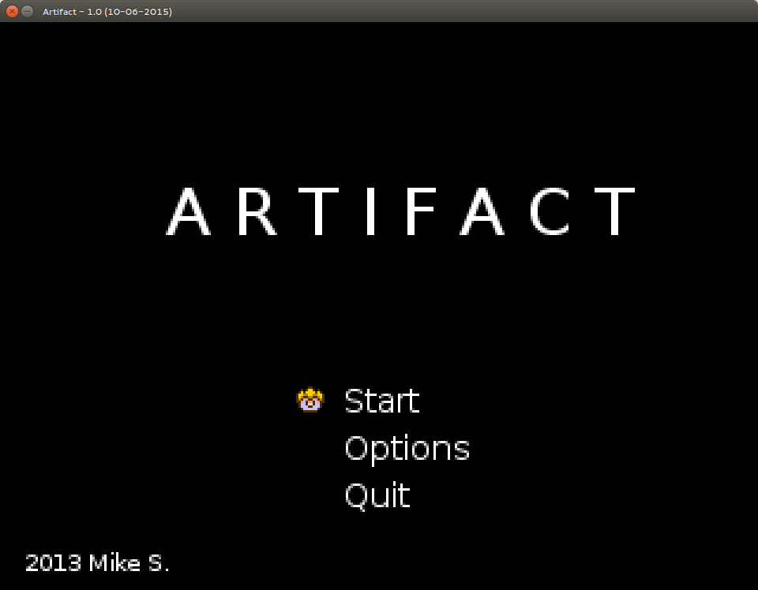
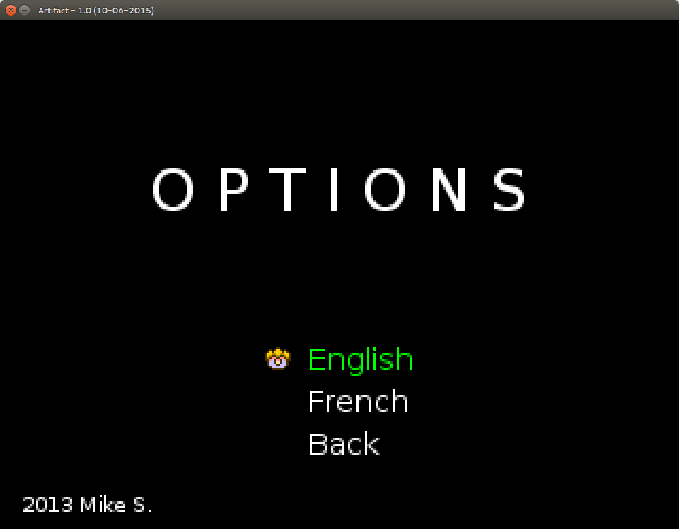
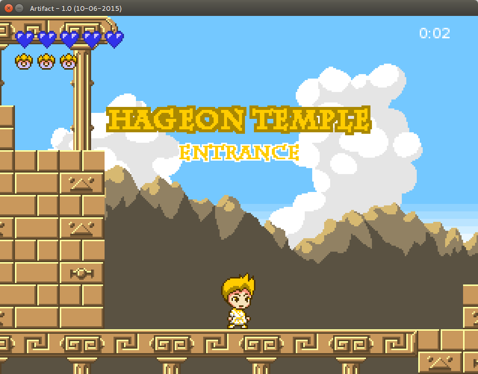

 Build status")
 Build Status")

Artifact
======

Artifact is the resulting porject from ForeignGuyMike about [creating a 2D platform game tutorial serie](https://www.youtube.com/playlist?list=PL-2t7SM0vDfcIedoMIghzzgQqZq45jYGv) on YouTube.

After some days of trying to hack this, I finally refactor the project to extract game framework from game. 

Small transformation has been operated:

### The main menu

* A new entry was added to route to Options screen.

Main menu

* Here is the new option screen, giving access to language selection

* And the well known Level 1 screen, but with the new refactored framework. 

